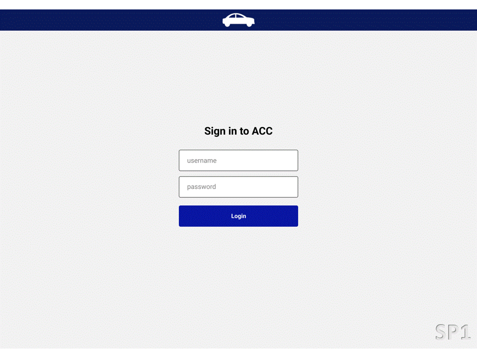

# HexTech - Technology Solutions
HexTech is a fictitious technology company created by students from the 4th Semester of Database at [Fatec SJC - Prof. Jessen Vidal](https://fatecsjc-prd.azurewebsites.net/suporte-moodle.php "Fatec SJC - Prof. Jessen Vidal") to complete their coursework and semester API project. We specialize in software development, database management, and technological innovation.

## Table of Contents
- [About HexTech](#about-hextech)
- [Project Purpose](#project-purpose)
- [Getting Started](#getting-started)
- [Sprint Timeline and Backlog](#sprint-timeline-and-backlog)
- [Development Tools](#development-tools)
- [Team Members](#team-members)

## About HexTech
We are a fictional company, developing semester projects during our graduation in Database at Fatec. These projects are API (Learning by Integrated Projects). The current [<b>members</b>](#team-members) of the group are listed in the README.md at the end.

## Project Purpose
Our [<b>project purpose</b>](./api_project_Embraer/%5BAC%20Config%20Control%5D%20Proposta%20FATEC%202023-1_rev1_0.docx) is to develop an Aircraft Configuration Control (ACC) system for Embraer, the Brazilian Aeronautics Company. Embraer is responsible for manufacturing military, commercial, executive, and agricultural aircraft. As the third-largest company in the world in executive aviation, Embraer is gradually reducing the dominance of European and American companies in the sector. With the ACC, Embraer will be able to manage and control the configuration of its aircraft, providing an efficient and effective solution to optimize their production process. The system will allow pilots to check the configuration of the aircraft they are flying, compare the items present, and know if there are Follow-on-Limitations (FOLs) for them, thus ensuring dispatch quality.

<!-- Old Part -->
Presentation of the wireframe for each proposal: 

<br>

## Getting Started
To begin working on this project, you'll need to follow these steps:

1. Clone this repository by running ``git clone https://github.com/GroupHextech/HEXTECH-API4sem.git`` in your terminal.
2. Download the necessary submodules by running ``git submodule update --init --recursive``.
3. Install the dependencies for each submodule separately. This project is divided into three submodules: <b>[acc-frontend](https://github.com/GroupHextech/acc-frontend)</b>, <b>[acc-backend](https://github.com/GroupHextech/acc-backend)</b>, and <b>[acc-documentation](https://github.com/GroupHextech/acc-documentation)</b>.

### Prerequisites
Before you start, make sure you have the following installed:

- Node.js and npm (for acc-frontend)
- Java 11 or higher (for acc-backend)
- Maven (for acc-backend)

### Installing
To install the necessary dependencies for each submodule, navigate to the submodule directory and run the following commands:

#### acc-frontend:
- The frontend is made with Vue.js and Typescript, and it is initialized by Vite. To get started with the frontend, navigate to the acc-frontend directory and run the following command:
```console
# Navigate to acc-frontend directory
cd acc-frontend

# Install dependencies
npm install
```

#### acc-backend:
- The backend is made with Springboot and has some dependencies such as Maven and other Spring Framework dependencies, and Lombok is also used. To get started with the backend, navigate to the acc-backend directory and run the following command:
```console
# Navigate to acc-backend directory
cd acc-backend

# Install dependencies
mvn install
```

#### acc-documentation:
- The documentation module contains the documentation of the API endpoints. To access the documentation, navigate to the acc-documentation directory and open the index.html file in your web browser.
```console
# Navigate to acc-documentation directory
cd acc-documentation

# Install dependencies
npm install
npm install --global yarn
yarn install
```

### Running
Each submodule has its own instructions on how to run it:

#### acc-frontend:
```console
# Navigate to acc-frontend directory
cd acc-frontend

# Start the development server
npm run dev
```

#### acc-backend:
```console
# Navigate to acc-backend directory
cd acc-backend

# Start the Springboot application
mvn spring-boot:run
```

#### acc-documentation:
```console
# Navigate to acc-documentation directory
cd acc-documentation

# Start the documentation server
yarn dev
```
By following these steps, you should be able to run each submodule independently and start working on your project. Good luck!

<!-- Old Part -->
<h2>User's Manual (Excuting the application)</h2>

Manual with all the steps to run the desktop application.
[User's Manual](./readme_pages/user_manual.md "User's Manual")
<br>

## Sprint Timeline and Backlog

### [Sprint 1](./readme_pages/sprint01_atividades_entrega.md) - (13/03 - 02/04)
- [X] Database modeling
- [X] Login page
- [X] Chassis page
- [X] Database normalization
### [Sprint 2](./readme_pages/sprint02_atividades_entrega.md) - (03/04 - 23/04)
- [X] Creating a database in the Oracle cloud
- [X] Backend integration with the database
- [X] Insertion of chassis and service bulletins in the database via .csv file
- [X] List of items and chassis
### [Sprint 3](./sprint3/README.md) - (24/04 - 14/05) 
- [X] User authentication
- [X] SB change log
- [X] Service Bulletin status update
- [X] List of chassis by item
- [X] Chart with the service bulletins status by chassis
- [X] Application installation guide
### Sprint 4 - (15/05 - 04/06)
- [ ] Registration of items and formulas
- [ ] Adjust methods according to permissions
- [X] Security configuration
- [ ] Chart with available items by chassis
- [ ] Chart with the number of chassis with a specific service bulletin
- [ ] Chart with the quantity of fleet incorporation
- [ ] Chart of the quantity of service bulletins on a chassis over time
- [ ] Declaration of Responsibility Agreement Signature
- [ ] User manual
- [ ] Documentation of API endpoints and frontend components
- [ ] FAQ

## Development Tools

### Frontend:


[](https://pinia.esm.dev/)
[](https://axios-http.com/)
[](https://www.json.org/)
[](https://bulma.io/)

### Backend:


[](https://spring.io/projects/spring-boot)
[](https://projectlombok.org/)

### Database:
[](https://www.oracle.com/cloud/)

## Team Members
| Photo | Name | Function | Links |
| --- | :---: | :---: | --- |
|  | <b>Danilo Verginio</b> | Product Owner |   |
|  | <b>Michel Rubens</b> | Scrum Master |   |
|  | <b>Luiz Borges</b> | Developer |   |
|  | <b>Victor Fernandes</b> | Developer |   |
|  | <b>William Antoniazzi</b> | Developer |   |

<br>

⬆ [Back to Home](#hextech---technology-solutions)
