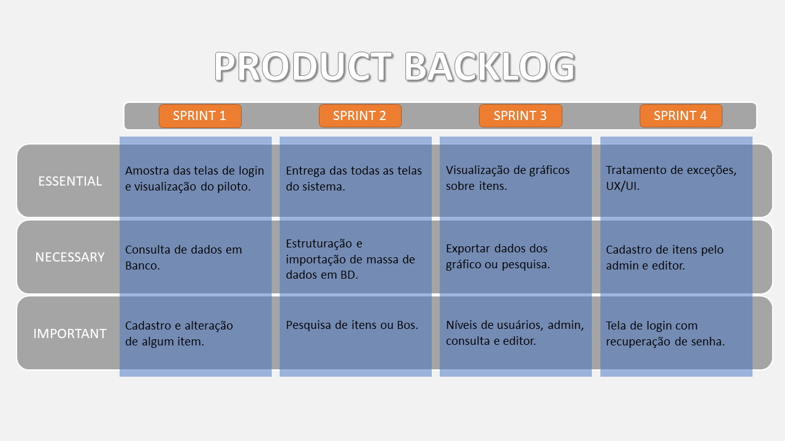

# HexTech - Technology Solutions

Fictitious company created by the students of the 4th Semester of Database of [Fatec SJC - Prof. Jessen Vidal](https://fatecsjc-prd.azurewebsites.net/suporte-moodle.php "Fatec SJC - Prof. Jessen Vidal") to carry out the curricular activities and the semester API.

Our ideas are geared towards software development, database and technological innovations.
 

<h2>Index</h2>

- [About the group](#about-the-group)
- [Project Purpose](#project-purpose)
- [User's Manual (Excuting the application)](#users-manual-excuting-the-application)
- [Sprint timeline activities and backlog](#sprint-timeline-activities-and-backlog)
    - [Sprint 1 Backlog and timeline](./readme_pages/sprint01_atividades_entrega.md)
    - [Sprint 2 Backlog and timeline](./readme_pages/sprint02_atividades_entrega.md)
    - Sprint 3 Backlog and timeline
    - Sprint 4 Backlog and timeline
- [Development tools](#development-tools)

 

<h2>About the group</h2>

| Scrum Master | PO | Developers | 
| ------------------- | ------------------- |  ------------------- | 
| [Michel Rubens Silva](mailto:michel.silva33@fatec.sp.gov.br "Michel Rubens Silva")  | [Danilo Verginio Silva](mailto:danilo.silva210b@fatec.sp.gov.br "Danilo Verginio Silva")  | [Luiz Borges](mailto: "Luiz Borges") |
| | | [Victor Fernandes](mailto: "Victor Fernandes")  |
| | | [William David Antoniazzi](mailto:william.antoniazzi@fatec.sp.gov.br "William David Antoniazzi")  |

 

<h2>Project Purpose</h2>

Creating a web system for the customer [EMBRAER S.A.](https://www.embraer.com.br/ "EMBRAER S.A.")

Empresa Brasileira de Aeronáutica (Embraer) is responsible for manufacturing military, commercial, executive or agricultural aircraft.

Embraer is the third largest company in the world in executive aviation, and it has been reducing the dominance of European and American companies in the sector.

 

Customer's desired scope: [Embraer API](./api_project_Embraer/%5BAC%20Config%20Control%5D%20Proposta%20FATEC%202023-1_rev1_0.docx)

 

<h2>User's Manual (Excuting the application)</h2>

Manual with all the steps to run the desktop application.
[User's Manual](./readme_pages/user_manual.md "User's Manual")

 

Presentation of the wireframe for each proposal: 

 

<h2>Sprint timeline activities and backlog</h2>

- [Sprint 1 Backlog and timeline](./readme_pages/sprint01_atividades_entrega.md)
- [Sprint 2 Backlog and timeline](./readme_pages/sprint02_atividades_entrega.md)
- Sprint 3 Backlog and timeline
- Sprint 4 Backlog and timeline

 

<h2>Development Tools</h2>

| Versioning  	| Database  	| Front-end  	| Back-end  	|
|---	|---	|---	|---	|
|  

 	| 
<a href="https://www.oracle.com/br/cloud/sign-in.html">ᴏʀᴀᴄʟᴇ ᴄʟᴏᴜᴅ</a> <a href="https://vertabelo.com/">ᴠᴇʀᴛᴀʙᴇʟᴏ</a>
 	| 

  	| 

  	|

| Communication   and Versioning | Databases | Front end | Back End |
| --- | --- | --- | --- |
| [GitHub](https://github.com/ "GitHub") | [Oracle Cloud - Autonomous](https://www.oracle.com/br/cloud/sign-in.html "Oracle Cloud") | [Figma](https://www.figma.com/ "Figma") | [Java JDK](https://www.oracle.com/br/java/technologies/javase/jdk11-archive-downloads.html "Java JDK") |
| [Git](https://git-scm.com/download/win "Git") | [Vertabelo](https://vertabelo.com/ "Vertabelo") | [Bootstrap](https://getbootstrap.com/ "Bootstrap") | [Spring](https://start.spring.io/ "Spring") |
| [MS Teams](http://https://www.microsoft.com/pt-br/microsoft-teams/log-in "MS Teams") | | [jQuery](https://jquery.com/ "jQuery") | [Apache Tomcat](https://tomcat.apache.org/ "Apache Tomcat") |
| | | [JavaScript](https://www.javascript.com/ "JavaScript") | [Springboot](https://spring.io/projects/spring-boot "Springboot") |
| | | [CSS3](https://www.w3schools.com/css/ "CSS3") | [Hibernate](https://hibernate.org/ "Hibernate") |
| | | [HTM5](https://www.w3c.br/pub/Cursos/CursoHTML5/html5-web.pdf "HTML5") | [JPA](https://www.ibm.com/docs/pt-br/was/8.5.5?topic=SSEQTP_8.5.5/com.ibm.websphere.nd.multiplatform.doc/ae/cejb_persistence.html "Java JPA") |
| | | [Axios](https://axios-http.com/ "Axios") | [DEVTools](https://docs.spring.io/spring-boot/docs/1.5.16.RELEASE/reference/html/using-boot-devtools.html "DEVTools") |
| | | [Ajax](https://www.w3schools.com/xml/ajax_intro.asp "AJAX") | |
| | | [Vue.js](https://vuejs.org/) | |
| | | [Vite](https://vitejs.dev/) | |
| | | [TypeScript](https://www.typescriptlang.org/) | |
| | | [Pinia](https://pinia.vuejs.org/) | |

 

[Home](#hextech---technology-solutions)

 
