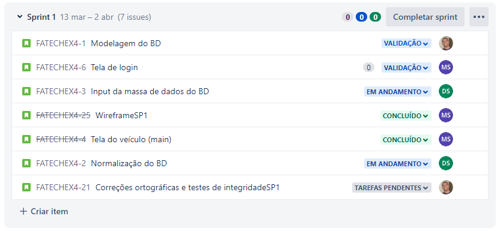
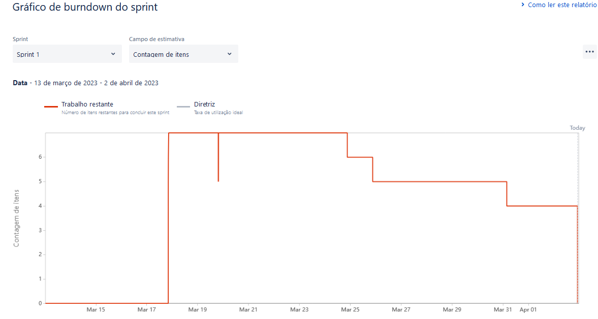

# Sprint 1 - Product and Sprint Backlog and timeline

Monitoring of activities carried out during the sprint, to evaluate deliverables and team effort.
Schedule, Burndown, Tasks and cumulative activities.

 

<h2>Index</h2>

- [Timeline](#timeline)
- [Product backlog in JIRA](#product-backlog-ion-jira)
- [Burndown Sprint01](#burndown-sprint01)

 

<h2>Timeline</h2>

| Date | Description |  
| ---- | ------ |
| 13/02/23 - 03/03/23 | Kick-Off |
| 13/03/23 - 02/04/23 | Sprint 01 Delivery | 
| 03/04/23 - 23/04/23 | Sprint 02 Delivery |  
| 24/04/23 - 14/05/23 | Sprint 03 Delivery | 
| 15/05/23 - 04/06/23 | Sprint 04 Delivery | 
| 13/06/23 - 14/06/23 | Solutions Fair + API Final Showing |

 

<h2>Product backlog in JIRA</h2>

 

 

<h2>Burndown Sprint 01</h2>

Graph with the evolution of the sprint execution time

 

<h2>Database and application evolution</h2>

Sprint monitoring of database and application developments.
Conceptual to physical model and application development at each sprint.

Conceptual model of database

 

[Home](https://github.com/GroupHextech/HEXTECH-API4sem)

 